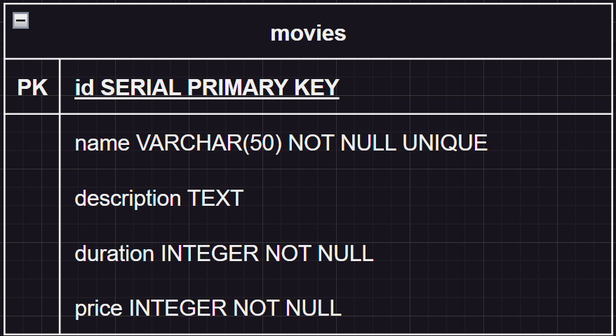

#  Movies

## 1 - Sobre

Nesse projeto, foi desenvolvido uma API contendo um CRUD de uma aplicação para filmes.

---

## 2 - Tecnologias

Um pouco das tecnologias que foram utilizadas no projeto: 

- [NodeJS](https://nodejs.org/en/)
- [Express](https://expressjs.com/pt-br/)
- [TypeScript](https://www.typescriptlang.org/)
- [PostgreSQL](https://www.postgresql.org/)
- [TypeORM](https://typeorm.io/)
- [Zod](https://zod.dev/?id=table-of-contents)

## 3 - Diagrama 

Diagrama da API definindo as relações entre as tabelas do banco de dados.



---

## 4 - Instalação e uso

### Requisitos:
- [NodeJS](https://nodejs.org/en/)
- [Npm](https://www.npmjs.com) ou [yarn](https://yarnpkg.com)
- Banco de dados [PostgreSQL](https://www.postgresql.org)

Clone o projeto em sua máquina e instale as dependências com o comando:

```shell
yarn ou npm install
```

Em seguida, crie um arquivo **.env**, copiando o formato do arquivo **.env.example**:

```
env.example -> .env
```

Configure as variáveis de ambiente com suas credenciais do Postgres e uma nova database da sua escolha.

Execute as migrations com o comando:

```
yarn typeorm migration:run -- -d src/data-source.ts

ou

npm run typeorm migration:run -- -d src/data-source.ts
```

Para rodar o servidor localmente: 

```
yarn dev ou npm run dev
```
#### As requisições podem ser testadas em programas como o [Insomnia](https://insomnia.rest/download), [Postman](https://www.postman.com), etc!
---


## 5 - Endpoints

| Método   | Rota       | Descrição                    |
|----------|------------|------------------------------|
| POST     | /movies    | Criação de filme.            |
| GET      | /movies    | Listar os filmes.            |
| DELETE   | /movies    | Deleta o filme.              |
| PATCH    | /movies    | Modifica o filme.            |


---

### CADASTRAR FILME

### `/movies`

### Requisição

```json
{
  "name": "Nome do novo filme",
  "description": "Descrição do filme",
  "duration": 60,
  "price": 90
}
```

### Retorno esperado
**STATUS 201**

```json
{
  "id": 1,
  "name": "Nome do novo filme",
  "description": "Descrição do filme",
  "duration": 60,
  "price": 90
}
```
---

### LISTAR FILMES

### `/movies`

#### Não é necessário um corpo para requisição.

### Retorno esperado
**STATUS 200**

```json
{
  "prevPage": null,
  "nextPage": null,
  "count": 1,
  "data": [
    {
      "id": 1
      "name": "Nome do novo filme",
      "description": "Descrição do filme",
      "duration": 60,
      "price": 90
    }
  ]
}
```

---

### DELETAR FILME

### `/movies/id`
### Não é necessário um corpo para requisição.

### Retorno esperado
**STATUS 204**

---

### EDITAR FILME 

### `/movies/id`

### Requisição

```json
{
"name": "Nome do novo filme PATCH"
}
```

### Retorno esperado
**STATUS 200**

```json
{
  "id": 1,
  "name": "Nome do novo filme PATCH",
  "description": "Descrição do filme",
  "duration": 60,
  "price": 90
}
```
